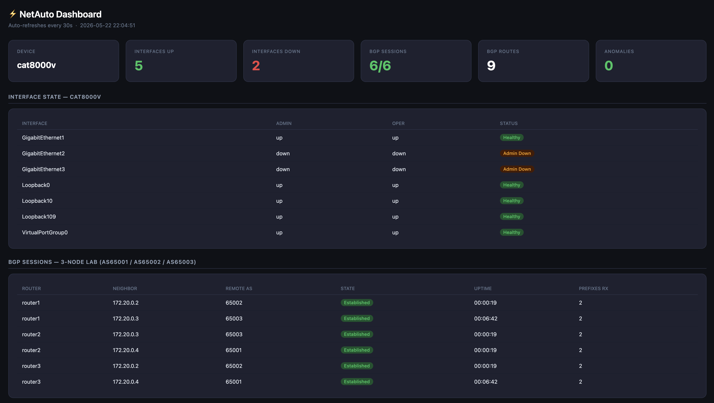
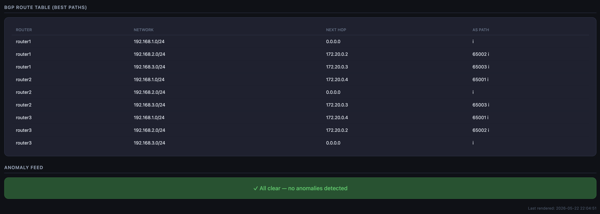

# NetAuto — Network Automation & Anomaly Detection

NetAuto is a Python-based network monitoring system combining NETCONF-based interface monitoring from a real Cisco IOS-XE Cat8k router with a simulated 3-node eBGP network (AS65001/AS65002/AS65003) running FRRouting in Docker. Detects interface flaps, BGP session drops, and route loss automatically. Generates AI-powered explanations via Gemini API and displays everything in a unified Flask dashboard.

Built as a portfolio project targeting software-focused network engineering roles at hyperscalers (Meta, Google, AWS).

## What it does

- Connects to a real Cisco IOS-XE Cat8k router via NETCONF/YANG (RFC 6241)
- Collects interface admin/oper state and stores time-series data in SQLite
- Simulates a 3-node eBGP network (AS65001/AS65002/AS65003) using FRRouting in Docker
- Monitors 6 BGP sessions and 9 routes across all autonomous systems
- Detects interface flaps, admin/oper mismatches, BGP session drops, and route loss
- Generates AI-powered plain-English anomaly explanations using Google Gemini API
- Displays unified observability in an auto-refreshing Flask dashboard
- Fully containerized with Docker

## Tech stack

| Layer | Technology |
|---|---|
| Device communication | NETCONF/YANG via ncclient |
| BGP simulation | FRRouting (FRR) in Docker |
| BGP monitoring | Python + docker exec/vtysh |
| Data storage | SQLite |
| Anomaly detection | Rule-based (flaps, mismatches, session drops, route loss) |
| AI explanations | Google Gemini API |
| Dashboard | Flask + HTML/CSS |
| Containerization | Docker + docker-compose |
| Language | Python 3.12 |

## Results

- 6/6 BGP sessions established across 3 autonomous systems
- 9 BGP best routes propagating correctly with multipath
- Route loss anomaly detection proven: fires within one poll cycle of router failure
- Auto-recovery detection: clears anomaly when router comes back online
- Interface state collected from real Cisco Cat8k via NETCONF

## Project structure

    netauto/
    collector/
        poller.py          # NETCONF data collection from real device
    anomaly/
        detector.py        # Flap + mismatch + BGP anomaly detection
        explainer.py       # AI-powered alert explanations
    dashboard/
        app.py             # Unified Flask dashboard
    bgp_lab/
        docker-compose.yml # 3-node FRR BGP lab
        monitor_bgp.py     # BGP session + route monitor
        configs/           # Per-router FRR configs
    docs/
        dashboard_v2.png
        dashboard_v2_routes.png
    Dockerfile
    requirements.txt
    README.md

## Anomaly types detected

| Type | Trigger | Layer |
|---|---|---|
| Interface flap | oper_status changes between polls | NETCONF |
| Admin/oper mismatch | admin=up but oper=down | NETCONF |
| BGP session down | state != Established | BGP |
| Route loss | best route count drops | BGP |

## How NETCONF works in this project

The collector connects to the router with ncclient on NETCONF port 830. It sends structured YANG/XML filters to retrieve hostname and interface state, then parses the XML response into Python dicts. This is different from CLI scraping because NETCONF returns structured, machine-readable data better suited for automation.

## Skills demonstrated

NETCONF/YANG · eBGP · FRRouting · Python automation · Docker · SQLite · Flask · AI API integration · Linux · Git · Cisco IOS-XE · Network anomaly detection
