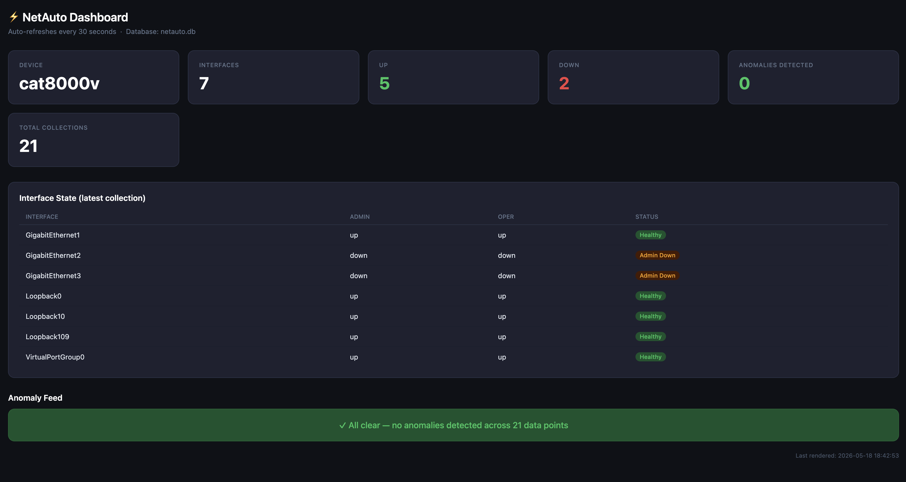

# NetAuto — Network Automation & Anomaly Detection

NetAuto is a Python-based network monitoring system that collects real interface state from a Cisco IOS-XE Cat8k router using NETCONF, stores historical snapshots in SQLite, detects network anomalies, generates AI-powered explanations, and displays device health in a Flask dashboard.

Built as a portfolio project for software-focused network engineering, network automation, and infrastructure roles.

## What it does

- Connects to a real Cisco IOS-XE Cat8k router using NETCONF/YANG
- Collects interface admin and operational state
- Stores historical interface snapshots in SQLite
- Detects interface state changes across collections
- Detects admin-up / oper-down mismatches
- Generates AI-powered plain-English explanations using Gemini API
- Displays device health in an auto-refreshing Flask dashboard
- Runs locally or inside Docker

## Tech stack

| Layer | Technology |
|---|---|
| Device communication | NETCONF via ncclient |
| Data format | XML/YANG |
| Data storage | SQLite |
| Anomaly detection | Python rule-based detection |
| AI explanations | Google Gemini API |
| Dashboard | Flask + HTML/CSS |
| Containerization | Docker |
| Language | Python 3.12 |

## Results

- Collected live interface state from a real Cisco Cat8k sandbox router
- Stored multiple polling snapshots in a SQLite database
- Detected interface state changes between collections
- Detected admin-up / oper-down mismatch conditions
- Generated plain-English troubleshooting explanations for anomalies
- Containerized the dashboard so it can run with Docker

## Quick start

Requirements:

- Python 3.11+
- Docker Desktop
- Cisco IOS-XE device or DevNet Sandbox with NETCONF enabled
- Optional: Gemini API key for AI explanations

### Run locally

    git clone https://github.com/gaygysyz2003/netauto.git
    cd netauto

    python3 -m venv venv
    source venv/bin/activate
    pip install -r requirements.txt

    python3 collector/poller.py
    python3 anomaly/detector.py
    python3 dashboard/app.py

Then open:

    http://localhost:5000

### Run with Docker

    docker build -t netauto .
    docker run --rm -p 5001:5000 netauto

Then open:

    http://localhost:5001

## Project structure

    netauto/
    ├── collector/
    │   ├── poller.py
    │   └── config.yaml
    ├── anomaly/
    │   ├── detector.py
    │   └── explainer.py
    ├── dashboard/
    │   └── app.py
    ├── docs/
    │   └── dashboard.png
    ├── Dockerfile
    ├── requirements.txt
    └── README.md

## How NETCONF works in this project

The collector connects to the router with ncclient on NETCONF port 830. It sends structured YANG/XML filters to retrieve hostname and interface state, then parses the XML response into Python data.

This is different from CLI scraping because NETCONF returns structured, machine-readable data that is better suited for automation.

## Anomaly types detected

### Interface state change

Detected when an interface changes operational state between collections, such as:

    GigabitEthernet1: up -> down

This can indicate a physical layer issue, remote peer failure, cable issue, or device-side problem.

### Admin-up / oper-down mismatch

Detected when an interface is configured as administratively up but operationally down.

This can indicate a failed link, unplugged cable, transceiver issue, or remote endpoint problem.

## AI explanation example

For each anomaly, the Gemini explainer can generate a short plain-English explanation covering:

1. The likely cause
2. What the engineer should check first
3. The risk if unresolved

## Skills demonstrated

Python network automation · NETCONF/YANG · Cisco IOS-XE · XML parsing · SQLite · Anomaly detection · Flask · Docker · Git/GitHub · AI API integration
